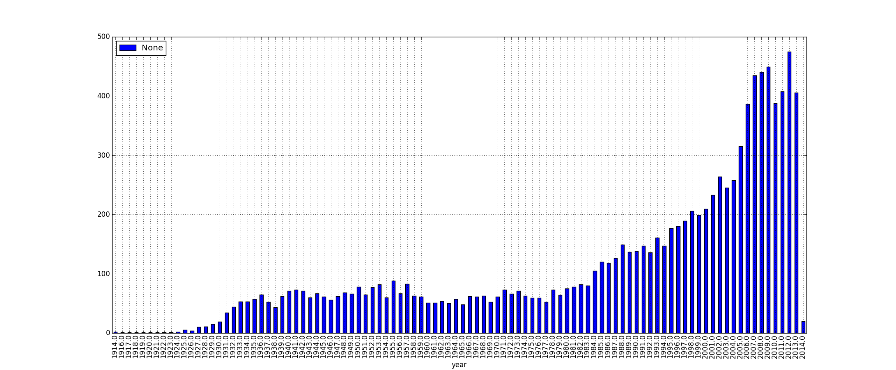
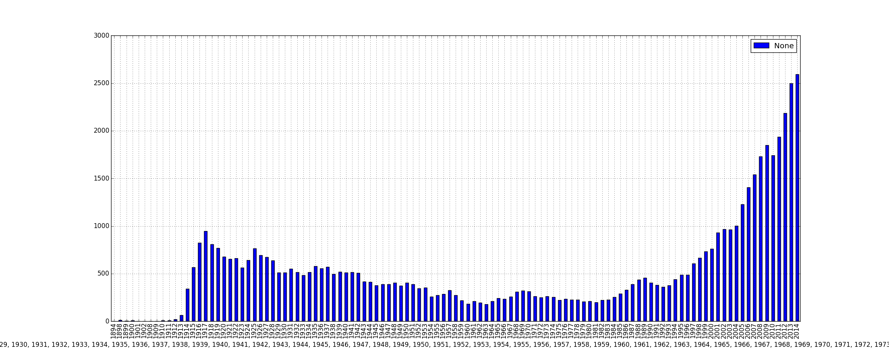

## Before 2/28/2014

Got subtitle data from [opensubtitle](opensubtitles.org)

## 2/28/2014

Scraped IMDbID, Title, Year, image, image_text, title_text from [IMDb](imdb.com) for all the US feature movies from 1874 to 2014. There are 59690 movies in total.

Matched the subtitle data with the scraped IMDb data and found that only 10789 movies have subtitle data. A plot of subtitle distribution over the years is made. 

## 3/2/2014

Wrote a new script to scrape subtitles from [subscene](subscene.com)

Wrote a code to parse a subtitle file in srt form to text and found MapReduce is not as fast as plain for loops

 

